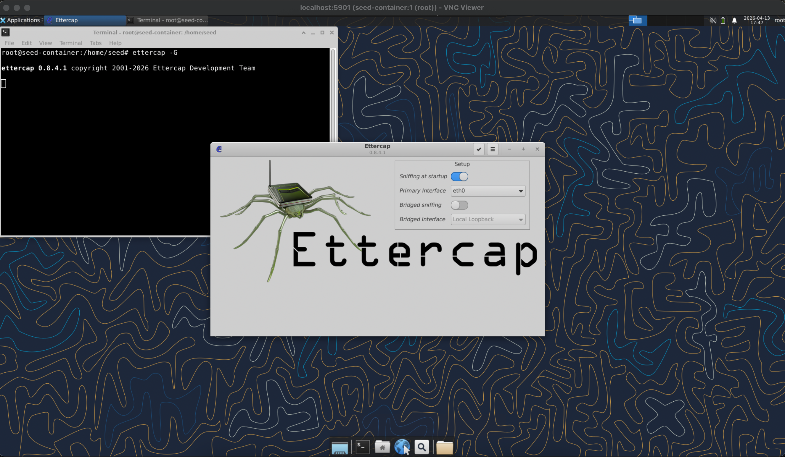
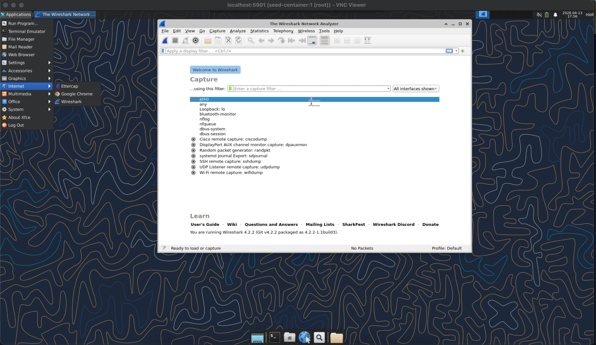
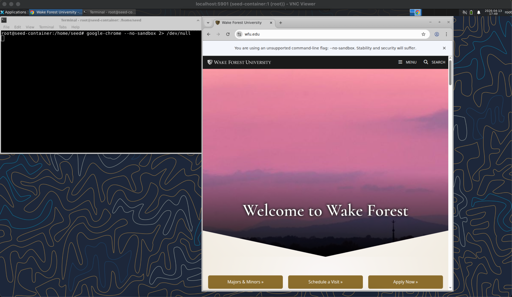

# CSC 348 Ettercap Lab
An apptainer implmentation for ARP poisoning across containers running on Amazon EC2

## Accessing your Virtual Machine

### Log in

For this lab you will need to connect multiple times to your virtual machine in order to properly deploy an Apptainer container for both the attacker and victim hosts. To connect to your VM, log as the `seed` user and edit the hostname of the VM by changing the value of `USER` to your WFU username (email address without @wfu.edu).

```
ssh seed@ettercap.USER.cs.ar53.wfu.edu
```

Once connected ensure that the temporary session directory for Apptainer exists.
```
mkdir -p /tmp/apptainer/mnt/session
```

### Starting the Attacker Container

Then you can start the attacking container by excuting the following command:
```
sudo ./start_attacker.sh
```
This script is essentially a wrapper script that deploys the Apptainer container with the following options:
```
apptainer shell --net --network 1234567890 --hostname seed-container --dns 8.8.8.8 --add-caps NET_RAW,NET_ADMIN ettercap.sif
```

You should see the following prompt if the container successfully deployed
```
[Apptainer-Security-Lab] /home/seed $
```

This container is connected to an isolated network within your VM, and each time you deploy a container it will receive a new IP address within the IP range `10.22.0.0/24`. The default gateway for this VLAN is `10.22.0.1` and you should always see that default gateway IP no matter the number of containers you deploy. The first container you deploy within your VM will have the IP `10.22.0.2`, the second will have the IP `10.22.0.3`, and so on.

You can always verify the IP address that was assigned to your container with the command `ip a`
```
ip a
```
    
<details> <summary> IP Info Example: </summary>
    
```
2: eth0@if5: <BROADCAST,MULTICAST,UP,LOWER_UP> mtu 1500 qdisc noqueue state UP group default 
    link/ether ea:65:98:60:38:e7 brd ff:ff:ff:ff:ff:ff link-netnsid 0
    inet 10.22.0.2/24 brd 10.22.0.255 scope global eth0
       valid_lft forever preferred_lft forever
    inet6 fe80::e865:98ff:fe60:38e7/64 scope link 
       valid_lft forever preferred_lft forever
```
    
</details>

### Starting the Victim Container

Once your attacker container is deployed you can deploy your victim container in a new SSH session by excuting the following command:
```
sudo ./start_victim.sh
```
This script is essentially a wrapper script that deploys the same Apptainer container with slightly different options:
```
apptainer shell --net --network 1234567890 --hostname seed-container --dns 8.8.8.8 ettercap.sif
```

If this is the second container you have deployed then it should receive the IP addresss `10.22.0.3` and you should be able to `ping` the attacker container using the network bridge if you know its IP address.

```
ping 10.22.0.2
```
<details> <summary> PING output: </summary>

```
PING 10.22.0.2 (10.22.0.2) 56(84) bytes of data.
64 bytes from 10.22.0.2: icmp_seq=1 ttl=64 time=0.095 ms
64 bytes from 10.22.0.2: icmp_seq=2 ttl=64 time=0.055 ms
64 bytes from 10.22.0.2: icmp_seq=3 ttl=64 time=0.051 ms
```

</details>

### Running Applications

#### Start VNC Server

After deploying your Apptainer container you can then launch a VNC server process from within the container using the following command:
```
tigervncserver :1 -localhost no -geometry 1920x1080 -depth 24 -xstartup /usr/bin/startxfce4
```
For the attacker container you should start the VNC server using `:1` for the port.

For the victim container you should use `:2` for the port.
```
tigervncserver :2 -localhost no -geometry 1920x1080 -depth 24 -xstartup /usr/bin/startxfce4
```

To connect to VNC you will then need to create another SSH session to create a connection from the attacking container's VNC server to your local computer. Using the IP address you found before with ```ip a``` and use the ```-L``` option to map your local port 5901 to the VM's port 5901 which is running the VNC server.
```
ssh -L 5901:10.22.0.2:5901 seed@ettercap.USER.cs.ar53.wfu.edu
```

To connect to the VNC server running on the victim container you will want to adjust your SSH command to map a different port on your local computer, i.e. `5902`, to the IP address and remote port for the victim container.
```
ssh -L 5902:10.22.0.3:5902 seed@ettercap.USER.cs.ar53.wfu.edu
```


Then within VNC Viewer you should be able to connect to ```localhost:5901``` to connect to the VNC server within your attacker container and `localhost:5902` to connect to your victim container.


### Starting VNC Applications

#### Starting Ettercap

Within your VNC session you can start the Ettercap GUI by opening a terminal and executing the following command:
```
ettercap -G
```



#### Starting Wireshark

To start Wireshark you can use the Applications menu in the upper left corner of the desktop and select **Applications** -> **Internet** -> **Wireshark**



#### Starting Google Chrome

To open a Google Chrome web browser you can execute the following command in your terminal:
```
google-chrome --no-sandbox 2> /dev/null
```


